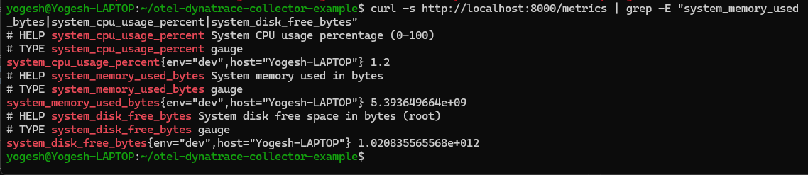
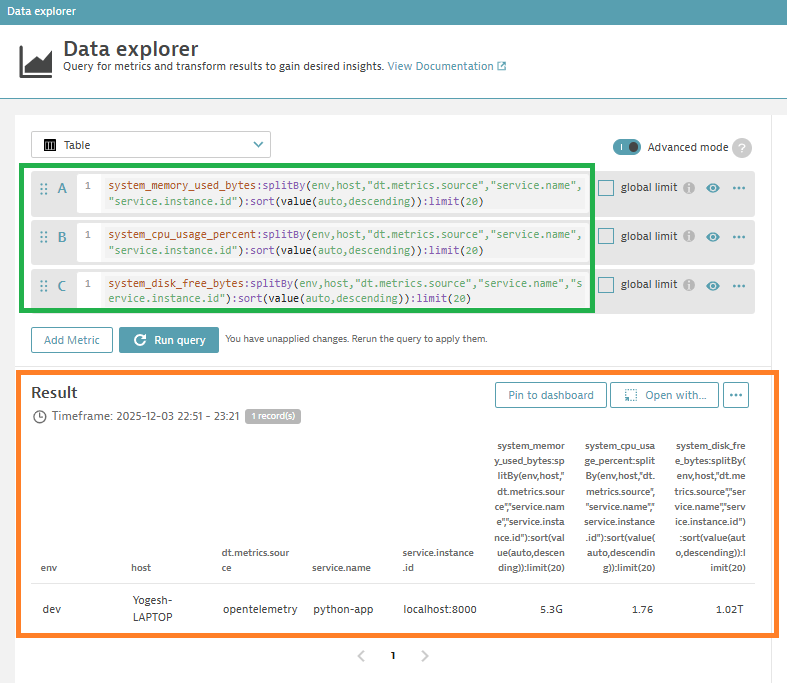

# OpenTelemetry Collector → Dynatrace SaaS

**Simple, working setup for pushing Prometheus metrics to Dynatrace using OpenTelemetry Collector Contrib.**

## ✅ What's Included

- **Python Flask app** - Exposes 7 Prometheus metrics (CPU, memory, disk, load, etc.)
- **OpenTelemetry Collector Contrib** - Scrapes metrics and pushes to Dynatrace via OTLP HTTP
- **Pre-configured scripts** - Ready to run, just set env vars

## 🚀 Quick Start

### 1. Set Environment Variables

```bash
export DYNATRACE_API_TOKEN="<your-api-token>"
export DYNATRACE_TENANT_URL="https://<your-tenant>.live.dynatrace.com"
```

**Where to find:**
- **Access Token**: Settings → Access tokens → Create new token
  - **Required scope:**
    - ✅ Ingest metrics (`metrics.ingest`) - REQUIRED for this project
  - **Optional scopes** (only if sending logs/traces):
    - ○ Ingest logs (`logs.ingest`) - Optional
    - ○ Ingest OpenTelemetry traces (`openTelemetryTrace.ingest`) - Optional
- **Tenant URL**: Your environment URL visible in browser address bar (e.g., `https://abc12345.live.dynatrace.com`)

### 2. Start the Collector

```bash
cd otel-dynatrace-collector
./run-collector.sh
```

This will:
- Start the Python metrics app on `http://localhost:8000/metrics`
- Start OTel Collector to scrape metrics
- Push metrics to Dynatrace OTLP endpoint (`/api/v2/otlp`)
- Expose collector internal metrics on `http://localhost:8888/metrics`

### 3. Verify Metrics in Dynatrace

1. Go to: `https://<your-tenant>.live.dynatrace.com`
2. Navigate to: **Metrics** → **Metrics Browser**
3. Search for: `system_cpu_usage_percent` or other metrics

## 📊 Metrics Provided

The Python app exposes these Prometheus metrics:

- `simple_dummy_metric` - Test metric
- `system_cpu_usage_percent{host,env}` - CPU usage (0-100%)
- `system_cpu_free_percent{host,env}` - Free CPU (0-100%)
- `system_memory_used_bytes{host,env}` - Memory used in bytes
- `process_memory_rss_bytes{host,env}` - Process memory (RSS)
- `system_disk_free_bytes{host,env}` - Free disk space
- `system_load_avg_1min{host,env}` - 1-minute load average

**Custom Labels:**
- `host` - Hostname (e.g., "my-laptop")
- `env` - Environment (e.g., "dev")

## � Verify Metrics Are Flowing

### Step 1: Check Python App Exports Metrics

```bash
# From your local machine, check the Python app is exposing metrics
curl -s http://localhost:8000/metrics | grep -E "system_memory_used_bytes|system_cpu_usage_percent|system_disk_free_bytes"
```

**Expected output** (see `assets/01-python-app-metrics.png`):
```prometheus
# HELP system_cpu_usage_percent System CPU usage percentage (0-100)
# TYPE system_cpu_usage_percent gauge
system_cpu_usage_percent{env="dev",host="Yogesh-LAPTOP"} 2.9

# HELP system_memory_used_bytes System memory used in bytes
# TYPE system_memory_used_bytes gauge
system_memory_used_bytes{env="dev",host="Yogesh-LAPTOP"} 5.35e+09

# HELP system_disk_free_bytes System disk free space in bytes (root)
# TYPE system_disk_free_bytes gauge
system_disk_free_bytes{env="dev",host="Yogesh-LAPTOP"} 1.02e+12
```

### Step 2: View in Dynatrace Metrics Browser

Once metrics are flowing to Dynatrace, use these DQL queries to visualize:

**Query 1: System Memory Used**
```
system_memory_used_bytes:splitBy(env,host,"dt.metrics.source","service.name","service.instance.id"):sort(value(auto,descending)):limit(20)
```

**Query 2: CPU Usage**
```
system_cpu_usage_percent:splitBy(env,host,"dt.metrics.source","service.name","service.instance.id"):sort(value(auto,descending)):limit(20)
```

**Query 3: Disk Free Space**
```
system_disk_free_bytes:splitBy(env,host,"dt.metrics.source","service.name","service.instance.id"):sort(value(auto,descending)):limit(20)
```

**Expected result** (see `assets/02-dynatrace-metrics-browser.png`):
- Metrics appear with your custom labels (host, env)
- Data points update every 5 seconds
- All 3 metrics visible in Metrics Browser

---

## 📸 Screenshots

### Screenshot 1: Python App Metrics
```bash
# Run this command in terminal
curl -s http://localhost:8000/metrics | grep -E "system_memory_used_bytes|system_cpu_usage_percent|system_disk_free_bytes"
```

*Terminal output showing Prometheus metrics from the Python Flask app*

### Screenshot 2: Dynatrace Metrics Browser

*System metrics visible in the Dynatrace Metrics Browser dashboard*

**Query used:**
```
system_cpu_usage_percent:splitBy(env,host,"dt.metrics.source","service.name","service.instance.id"):sort(value(auto,descending)):limit(20)
```

---

## �🛠️ Architecture

```
Python Flask App (localhost:8000/metrics)
         ↓ (5-second scrape via HTTP GET)
OpenTelemetry Collector Contrib
         ↓
    Batch Processor (10s timeout)
         ↓
    OTLP HTTP Exporter
         ↓
Dynatrace SaaS API (/api/v2/otlp)
         ↓
Metrics Browser (visible & queryable)
```

## 📝 Configuration Files

- **`config.yaml`** - OTel Collector config
  - Prometheus receiver (scrapes localhost:8000/metrics)
  - OTLP HTTP exporter (pushes to Dynatrace)
  - Prometheus exporter (internal metrics on 0.0.0.0:8888)
  - Debug exporter (logs to stdout)

- **`app.py`** - Python Flask metrics app
  - Runs on port 8000
  - Updates metrics every 2 seconds
  - Uses psutil for real system data

- **`requirements.txt`** - Python dependencies
  - flask
  - prometheus_client
  - psutil

## 🔧 Requirements

- Python 3.7+
- OpenTelemetry Collector Contrib v0.141.0 (`otelcol-contrib` in PATH)
- Dynatrace SaaS account with valid API token

## 🐛 Troubleshooting

### Collector not starting
```bash
# Check logs
tail -50 /tmp/collector.log

# Verify binary is installed
otelcol-contrib --version

# Verify environment variables are set
echo $DYNATRACE_API_TOKEN
echo $DYNATRACE_TENANT_URL
```

### Metrics not appearing in Dynatrace

1. Verify metrics are being scraped locally:
   ```bash
   curl http://localhost:8000/metrics | grep system_
   ```

2. Check collector is exporting:
   ```bash
   curl http://localhost:8888/metrics | head -20
   ```

3. Check Dynatrace API token and tenant URL are correct

### Port already in use

```bash
# Kill existing processes
pkill -f "otelcol-contrib"
pkill -f "python app.py"

# Wait 2 seconds and restart
sleep 2
./run-collector.sh
```

## 📖 Files

- `README.md` - This file (full documentation)
- `QUICK_START.md` - Quick reference (4 steps to get started)
- `API_TOKEN_SETUP.md` - Detailed guide for creating Dynatrace API token
- `app.py` - Python metrics app
- `config.yaml` - OTel Collector configuration
- `requirements.txt` - Python dependencies
- `run-collector.sh` - Start script
- `validate.sh` - Pre-flight validation
- `.env.example` - Environment variables template

## ✨ What Makes This Work

✅ **OTLP HTTP** - Standard, widely-supported OTel exporter

✅ **Prometheus Format** - Python app uses industry-standard Prometheus metrics

✅ **Batch Processing** - Efficient metric batching before export

✅ **Custom Labels** - Host and environment metadata included

✅ **Auto-Discovery** - Dynatrace automatically maps OTLP signals to metrics

## 📚 References

- [OpenTelemetry Collector Documentation](https://opentelemetry.io/docs/collector/)
- [Dynatrace OTLP Ingestion](https://docs.dynatrace.com/docs/shortlink/metrics-api-v2)
- [Prometheus Metrics Format](https://prometheus.io/docs/concepts/data_model/)

---

**Status**: ✅ Working and tested
**Last Updated**: 2025-12-03
